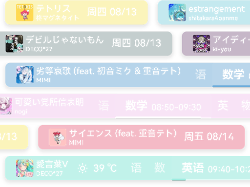
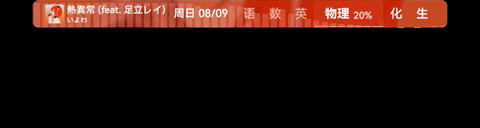
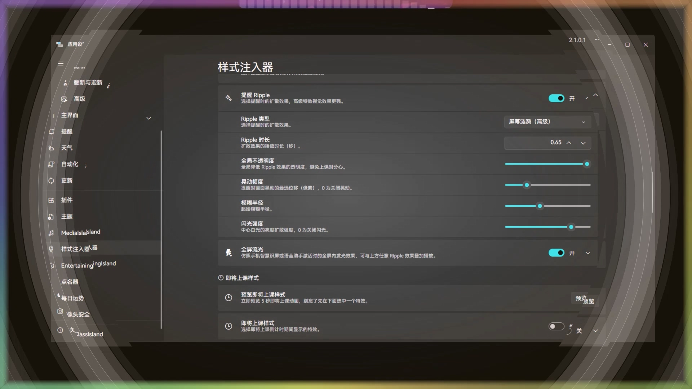
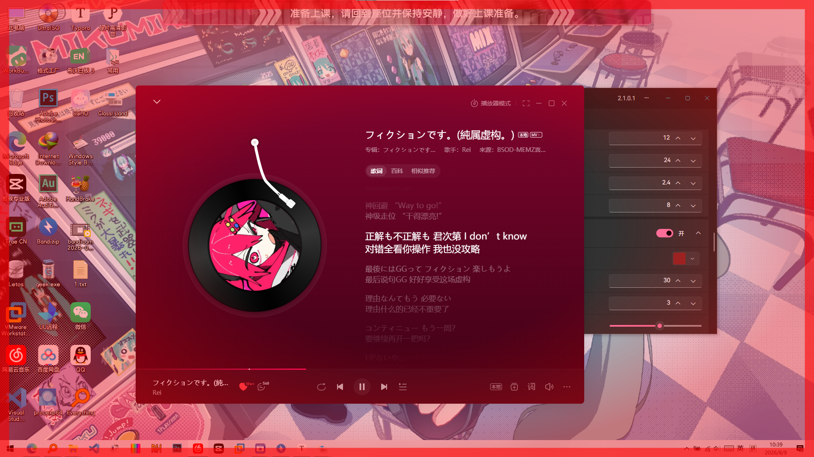
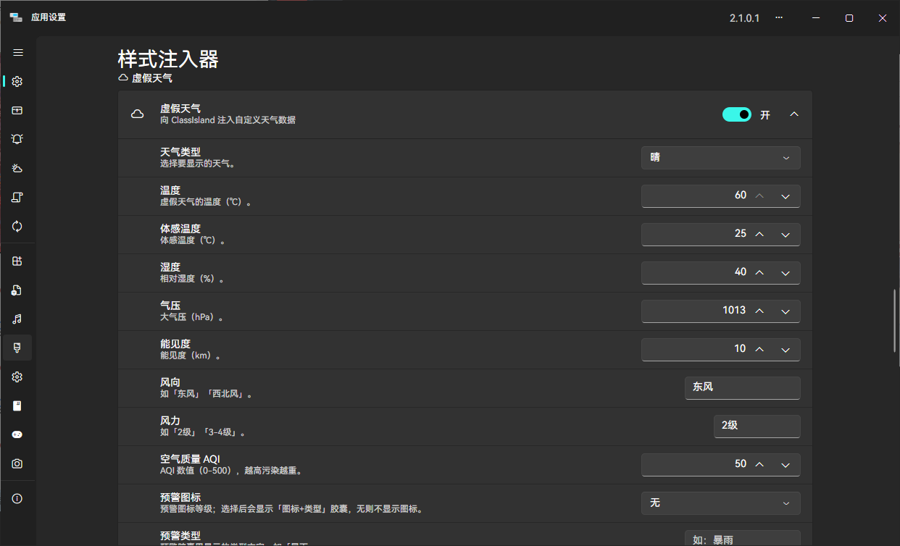
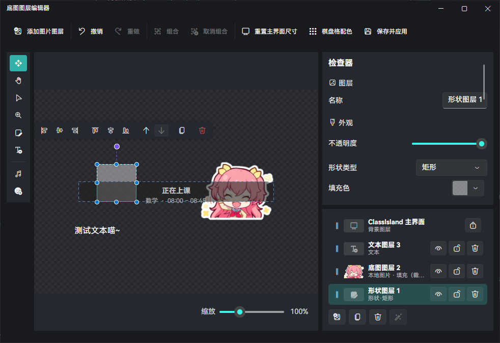
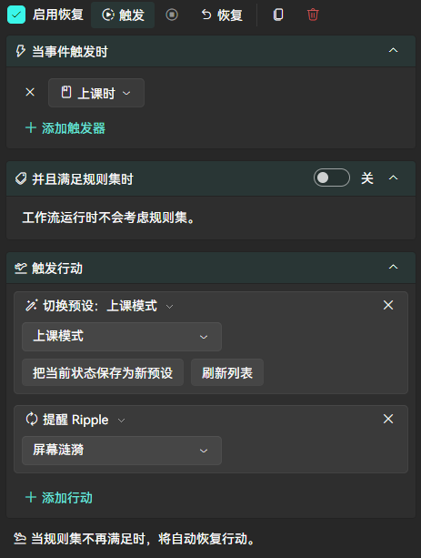
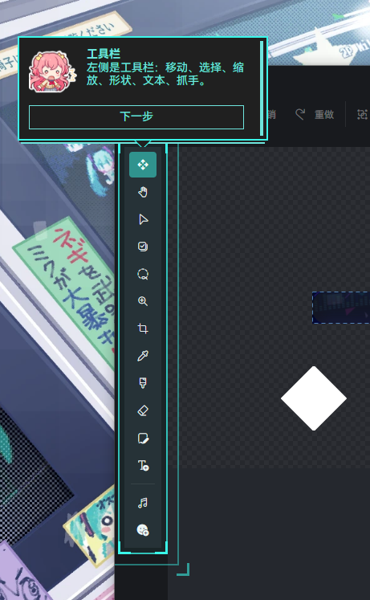

# ClassIsland 样式注入器

让 ClassIsland 再次伟大！自定义 ClassIsland 的显示行为和动画效果！
访问神秘链接继续赤石：[xxtsoft.top](https://xxtsoft.top)

## 它能做什么

### 换皮肤
- **背景**：纯色、渐变色随便换，还能叠纹理，甚至还有**动态频谱**

- **背景图片**：放一张本地图片当壁纸，或者让一个文件夹里的图片自动轮播，甚至可以直接用正在播放的歌的专辑封面

### 跟着音乐变颜色
- 播放音乐时，主界面的背景、边框、阴影会自动变为专辑封面的配色
- **动态主题色**：把当前专辑的主色调应用到 ClassIsland 全局主题强调色（专辑封面显示来自 [MediaIsland](https://github.com/bywhite0/MediaIsland)，取色可以独立运行）

### 动起来
- **持续动画**：呼吸、浮动、波浪……让主界面轻轻动起来。

- **显示动画**：主界面出现 / 消失时，淡入淡出、缩放或滑入滑出

- **列表翻页动画**：自定义轮播容器、上课提醒横幅等列表的上翻切换动画

- **提醒特效**：收到提醒时有脉冲、弹跳、抖动、闪烁等强调动画，还有线性、放射、粒子、舞萌花火、爆炸、**屏幕涟漪**等各种 Ripple，甚至有一个覆盖整屏的**全屏流光效果**

- **即将上课倒计时**：快上课时，屏幕上会滑过箭头 `>>`、扩散光环、扫描线或**光带**，还可以叠加红色警告边框

- **点击特效**：点击主界面时产生轻微跳跃或软边扩散圆环反馈

### 虚假天气
- 向 ClassIsland 注入自定义天气数据，还能报告虚假**气象灾害预警**

### 底图图层编辑器
- 在 ClassIsland 中使用像 Photoshop 一样的多图层编辑器！

### 一键切换方案
- 把自己调好的整套效果保存成预设
- 配合 ClassIsland 的**自动化**，还能按时间、课程等条件自动切换方案

### 不必担心不会用

- 自带教学功能，虽然剧情有点猎奇（有些我已经删了，放心食用）

---

### 感谢梁圣开源

本项目基本上全部由 DeepSeek V4 Flash 编写，真的便宜，希望国模能越做越好吧。

## 开源许可与版权

本项目基于 [MIT 许可证](./LICENSE) 开源。

### 直接依赖的开源库

| 库 | 版本 | 用途 | 许可证 |
|---|---|---|---|
| ClassIsland.PluginSdk | 2.0.0.2 | ClassIsland 插件 SDK（宿主交互 / 设置页 / 服务） | MIT |
| MaterialColorUtilities | 0.3.0 | 专辑封面取色（Material You 调色板） | MIT |
| NAudio.Wasapi | 2.2.1 | 音频频谱捕获（动态频谱纹理） | MIT |
| System.Drawing.Common | 8.0.25 | GIF 逐帧解码、屏幕抓取 | MIT |

### 引用的外部资源

- **Windows.Media.Control（SMTC）**：调用 Windows 系统媒体会话（WinRT）API，获取正在播放的媒体信息、播放状态与专辑封面。
- **Fluent System Icons**（Microsoft）：界面图标，MIT 许可证。
- **sekai-stickers 贴纸库**（[TheOriginalAyaka/sekai-stickers](https://github.com/TheOriginalAyaka/sekai-stickers)）：编辑器「添加贴纸」功能按需从该仓库在线拉取贴纸列表与缩略图（缓存到本地配置目录，不随插件分发）。贴纸为社区粉丝自制，仅供个人使用，相关角色形象版权归原版权方（SEGA / Colorful Palette）所有。
- **hanabi 效果**（[LingFeng-bbben/MajdataView](https://github.com/LingFeng-bbben/MajdataView/)）：舞萌 hanabi 效果贴图。
### 自带素材

- `Assets/` 目录下的示例图片、教程横幅与演示音效为本插件自带素材，随插件分发，仅用于功能演示与内置教程，Music 目录下的示例音乐归原版权方所有。
